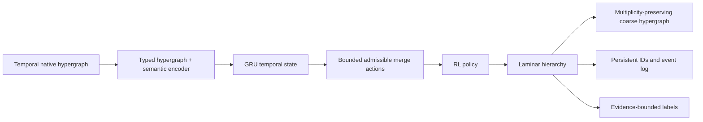

# TRAIL-Hyper

**Temporally Recurrent Reinforcement-learning for Adaptive, Interpretable Laminar Hypergraph abstraction.**

This repository is a reproducible starter for multi-resolution semantic abstraction over the evolving knowledge hypergraph in Collection 10. It treats hyperedges as native multi-way objects; it does not silently replace them with pairwise edges.

<p align="center">
  
</p>

<h1 align="center">TRAIL-Hyper</h1>

<p align="center">
  <strong>Temporally Recurrent Reinforcement-learning for Adaptive, Interpretable Laminar Hypergraph Abstraction</strong>
</p>


## Research claim and scope

The implementation tests a proposed method rather than reporting completed research results. RL graph coarsening, dynamic hypergraph learning, and recurrent temporal encoders are established ideas. The proposed contribution is their use together for **temporally stable, semantic, laminar, native-hypergraph coarsening**. See [`paper/main.tex`](paper/main.tex) for precise, cautious positioning.

## Setup

```bash
python -m venv .venv
.venv\\Scripts\\activate
pip install -e ".[dev]"
```

## Data and snapshots

The source files are intentionally not copied into the repository. Provide the exported temporal hypergraph and choose cumulative cutoffs:

```bash
trail-hyper describe \
  --hypergraph "D:/My files/Temporary/Downloads/Eskatrina/tkh_collection10.json" \
  --cutoffs 2022 2024 2026 \
  --output artifacts/description.json

trail-hyper run \
  --hypergraph "D:/My files/Temporary/Downloads/Eskatrina/tkh_collection10.json" \
  --cutoffs 2022 2024 2026 \
  --levels 2 \
  --rl \
  --output artifacts/run.json

trail-hyper experiment \
  --hypergraph "D:/My files/Temporary/Downloads/Eskatrina/tkh_collection10.json" \
  --cutoffs 2022 2024 2026 --levels 2 \
  --output artifacts/experiments.json
```

Snapshot rule: a node is available when `first_seen_year <= cutoff`; a hyperedge is available when its own `year <= cutoff`. This avoids future leakage. The original source has `node_year` semantics documented in `meta`; `first_seen_year` is used for availability because it represents first appearance in the corpus.

## What is implemented

- Native temporal hypergraph loader and snapshot diagnostics (T1).
- Hyperedge arity distributions and projection-loss accounting.
- Deterministic semantic/structural warm-start coarsener producing a laminar hierarchy.
- Executable hyperedge-collapse rule: retain coarse multi-way hyperedges, endpoint multiplicities, relation type, and internal evidence.
- A deterministic, executable GRU recurrent memory is updated at each snapshot and injected into semantic coarsening compatibility.
- Persistent super-node matching and a birth/growth/merge/split/death event log.
- A small NumPy policy-gradient (`REINFORCE`) policy selects the first 128 bounded merge actions with `--rl`; the deterministic heuristic completes each level as a reproducible warm start. PPO/HyperGNN can be substituted behind the same action interface.
- Registered baseline runner and evaluation helpers for coherence, stability, and label-faithfulness audits.
- DOT diagrams exported per snapshot as `artifacts/coarse_<cutoff>.dot`.

## Neo4j: native hypergraph model

Start the database and load the source export:

```bash
docker compose up -d
trail-hyper neo4j-seed \
  --hypergraph "D:/My files/Temporary/Downloads/Eskatrina/tkh_collection10.json" \
  --password trail-hyper-local
```

The graph is stored as `(:Entity)` nodes, first-class `(:Hyperedge)` nodes, and `(:Hyperedge)-[:HAS_MEMBER {position}]->(:Entity)` incidence relationships. This is the Neo4j representation of the native hypergraph; it does not use a clique projection. Open Neo4j Browser at `http://localhost:7474`.

```cypher
// Inspect native multi-way relations available at a cutoff.
MATCH (h:Hyperedge)-[:HAS_MEMBER]->(n:Entity)
WHERE h.year <= 2024 AND n.first_seen_year <= 2024
RETURN h.relation_type, h.arity, collect(n.surface_form) AS endpoints
LIMIT 25;
```

## Guardrails

- The hierarchy is laminar by construction: each parent is a union of previous-level groups.
- Actions are restricted to top-k admissible candidate merges, avoiding an O(|V|²) unrestricted action space.
- Relation type and endpoint multiplicity are never discarded while coarsening.
- Temporal matching never uses future snapshots.
- Labels must be generated only from contemporaneous member evidence. The code emits an auditable labeller input; it does not fabricate labels or call an LLM.
- GRU and RL choices are reproducibly seeded; the manuscript distinguishes the runnable baseline from a trained research model.

## Repository map

```
src/trail_hyper/   implementation
tests/             small synthetic-hypergraph tests
paper/             arXiv-style manuscript and bibliography
```

## Method diagram



## Experiment plan

The executable runner reports structural-only, semantic/structural recurrent, and semantic-emphasis baselines. The registered full comparison adds: (1) native coarsening without RL/RNN, (2) clique expansion + graph clustering, (3) semantic-only clustering, (4) no temporal memory, and (5) no semantic signal. Key metrics are hyperedge retention, semantic coherence, temporal membership agreement, event rate, label support/over-claim rate, Recall@$k$, and MRR against `ground_truth.json`.

## Paper figures

After running the experiment command, regenerate all manuscript figures with:

```bash
python paper/figures/generate_figures.py \
  --hypergraph "D:/My files/Temporary/Downloads/Eskatrina/tkh_collection10.json" \
  --experiments artifacts/experiments.json \
  --out paper/figures
```
